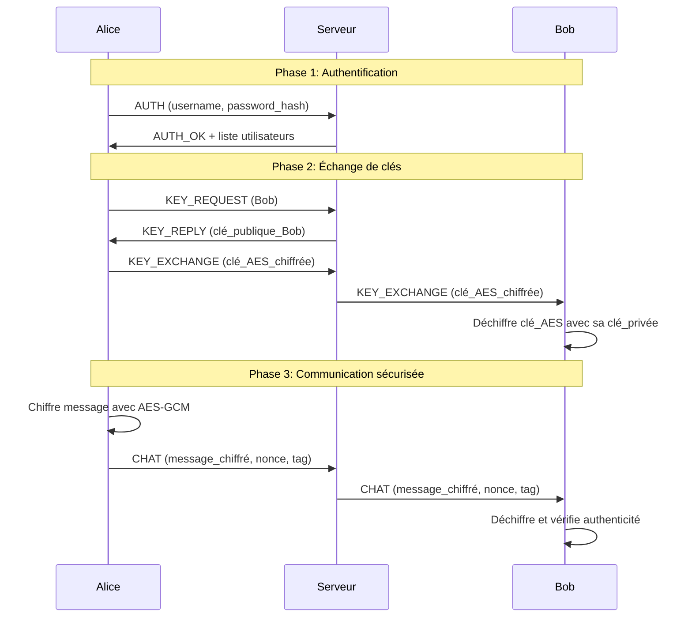

# Messagerie Sécurisée - Cryptochat

**Une application de messagerie instantanée avec chiffrement de bout en bout (E2EE) implémentant RSA + AES-GCM**

## Fonctionnalités

### **Sécurité Avancée**

- **Chiffrement de bout en bout** : Les messages sont chiffrés côté client, le serveur ne voit jamais les données en clair
- **Échange de clés hybride** : RSA (2048 bits) pour l'échange sécurisé des clés AES (256 bits)
- **Sessions de chiffrement** : Clés AES temporaires avec rotation automatique
- **Authentification forte** : Hachage SHA-256 des mots de passe

### **Messagerie Complète**

- Interface graphique inspirée de Google Messages et peut etre ameliorer
- Conversations multiples simultanées
- Statut des utilisateurs (en ligne/hors ligne)
- Messages hors ligne avec stockage automatique
- Historique des conversations
- Thème clair/sombre

### **Architecture**

- Client-serveur TCP asynchrone avec threading
- Protocole JSON personnalisé avec validation
- Gestion robuste des erreurs et reconnexions
- Modules cryptographiques séparés et testés

## Architecture du projet

'''
messagerie-secure/
├── crypto/                    # Modules cryptographiques
│   ├── aes_manager.py        # Gestion AES-GCM (chiffrement symétrique)
│   ├── rsa_manager.py        # Gestion RSA (chiffrement asymétrique)
│   ├── key_exchange.py       # Protocole d'échange de clés hybride
│   └── utils.py              # Fonctions mathématiques pour RSA
│
├── server/                   # Serveur et client réseau
│   ├── server.py            # Serveur principal (routeur de messages)
│   ├── client_socket.py     # Client réseau avec thread d'écoute
│   ├── MessageProtocole.py  # Protocole de communication JSON
│   └── database_manager.py  # Schéma de base de données
│
├── GUI.py                   # Interface graphique principale (PyQt5)
│
├── data/                    # Données persistantes
│   ├── keys/               # Clés RSA chiffrées des utilisateurs
│   ├── users.json          # Base de données des utilisateurs
│   ├── public_keys.json    # Cache des clés publiques
│   └── offline_messages.json # Messages en attente
│
├── requirements.txt         # Dépendances Python
├── README.md               # Ce fichier
└── .gitignore
'''

## 🚀 Installation

### Prérequis

- **Python 3.8 ou supérieur**
- **pip** (gestionnaire de packages Python)

### Installation des dépendances

```bash
# Cloner le projet
git clone https://github.com/votre-username/messagerie-secure.git
cd messagerie-secure

# Installer les dépendances
pip install -r requirements.txt

# Ou installer manuellement
pip install cryptography pyqt5
```

### Dépendances principales

- `cryptography` : Bibliothèque cryptographique
- `PyQt5` : Interface graphique
- `Python 3.8+` : Exécution du code

## Utilisation

### 1. Lancer le serveur

```bash
python server/server.py
```

Le serveur démarre sur `localhost:5555` et crée automatiquement les dossiers nécessaires.

### 2. Lancer l'application client

```bash
python GUI.py
```

### 3. Premier utilisateur (Inscription)

1. Dans la fenêtre de connexion, entrez :
   - Serveur : `localhost`
   - Port : `5555`
   - Nom d'utilisateur et mot de passe
2. Cliquez sur "S'inscrire"
3. Attendez la génération des clés RSA (quelques secondes)

### 4. Second utilisateur

1. Lancez une seconde instance de `GUI.py`
2. Inscrivez un deuxième utilisateur avec des identifiants différents
3. Connectez-vous avec les deux utilisateurs

### 5. Communiquer

1. Sélectionnez un contact dans la barre latérale
2. L'échange de clés se fait automatiquement
3. Tapez votre message et appuyez sur Entrée

## Modules Techniques

### **RSA Manager** (`rsa_manager.py`)

Génération et gestion des clés RSA :

- Génération de nombres premiers avec test de primalité Miller-Rabin
- Calcul des paramètres RSA (n, e, d, p, q, dmp1, dmq1, iqmp)
- Chiffrement/déchiffrement avec OAEP padding
- Sauvegarde sécurisée des clés privées (AES-CBC + PBKDF2)

```python
# Exemple d'utilisation
from crypto.rsa_manager import RSAManager

# Générer une paire de clés
public_key, private_key = RSAManager.generate_keypair(bit_length=2048)

# Sauvegarder les clés
RSAManager.save_keypair("alice", public_key, private_key, "motdepasse")

# Charger les clés
loaded_public, loaded_private = RSAManager.load_keypair("alice", "motdepasse")
```

### **AES Manager** (`aes_manager.py`)

Chiffrement symétrique AES-GCM :

- Génération de clés AES (128, 192, 256 bits)
- Chiffrement avec authentification intégrée (GCM)
- Validation robuste des paramètres

```python
from crypto.aes_manager import AESManager

# Générer une clé AES
aes_key = AESManager.generate_session_key(256)

# Chiffrer un message
ciphertext, nonce, tag = AESManager.encrypt(aes_key, b"Message secret")

# Déchiffrer
plaintext = AESManager.decrypt(aes_key, ciphertext, nonce, tag)
```

### **Key Exchange** (`key_exchange.py`)

Protocole d'échange de clés hybride :

1. Alice → Serveur : Demande clé publique de Bob
2. Serveur → Alice : Clé publique RSA de Bob
3. Alice : Génère clé AES-256
4. Alice : Chiffre clé AES avec clé publique RSA de Bob
5. Alice → Bob : Clé AES chiffrée
6. Bob : Déchiffre clé AES avec sa clé privée RSA
7. Alice ↔ Bob : Communication avec AES-GCM

### **Message Protocol** (`MessageProtocole.py`)

Protocole de communication avec 20+ types de messages :

- Authentification et inscription
- Échange de clés
- Messages chiffrés
- Gestion des utilisateurs

## Sécurité

### Caractéristiques implémentées

- **Chiffrement de bout en bout** : Le serveur ne peut pas lire les messages
- **Forward secrecy** : Rotation automatique des clés AES
- **Authentification des messages** : Via AES-GCM
- **Protection contre les replay attacks** : Nonces uniques
- **Stockage sécurisé des clés** : Chiffrement AES-CBC + PBKDF2
- **Validation des entrées** : À chaque étape du processus

### Workflow de sécurité



## 🧪 Tests

Chaque module inclut des tests complets :

```bash
# Tester RSA
python crypto/rsa_manager.py

# Tester AES
python crypto/aes_manager.py

# Tester l'échange de clés
python crypto/key_exchange.py

# Tester le protocole
python server/MessageProtocole.py

# Lancer tous les tests
python -m pytest tests/
```

### Exemple de test d'intégration

```python
# Simulation d'une conversation entre Alice et Bob
from crypto.key_exchange import KeyExchangeProtocol
from crypto.rsa_manager import RSAManager

# Génération des clés
alice_pub, alice_priv = RSAManager.generate_keypair()
bob_pub, bob_priv = RSAManager.generate_keypair()

# Échange de clés
alice_exchange = KeyExchangeProtocol(alice_priv, alice_pub)
encrypted_key = alice_exchange.initiate_key_exchange("bob", bob_pub)

# Déchiffrement côté Bob
bob_exchange = KeyExchangeProtocol(bob_priv, bob_pub)
bob_exchange.receive_key_exchange("alice", encrypted_key)

# Message chiffré
message_data = alice_exchange.encrypt_message("bob", "Bonjour Bob!")
decrypted = bob_exchange.decrypt_message("alice", 
    message_data['ciphertext'],
    message_data['nonce'],
    message_data['tag']
)
print(decrypted.decode('utf-8'))  # "Bonjour Bob!"
```

## Contribution

Les contributions sont les bienvenues ! Voici comment contribuer :

### Rapport de bugs

1. Vérifiez que le bug n'a pas déjà été rapporté dans les [Issues](https://github.com/ketch3kev-jpg/Messagerie-AES-RSA/issues)
2. Créez une nouvelle issue avec un titre descriptif
3. Incluez :
   - Étapes pour reproduire le bug
   - Comportement attendu vs. comportement actuel
   - Captures d'écran si applicable
   - Version de Python et des dépendances

### Suggestions d'améliorations

- Implémenter des signatures numériques plus avancees pour l'authenticité des clés
- Ajouter le transfert de fichiers sécurisé
- Ajouter un mode appel audio et video
- Support multi-plateforme (Android/iOS)

### Processus de contribution

```bash
# 1. Fork le projet
# 2. Créer une branche
git checkout -b feature/nouvelle-fonctionnalite

# 3. Faire vos modifications
# 4. Tester vos changements
python -m pytest tests/

# 5. Commiter
git commit -m "Ajout: nouvelle fonctionnalité"

# 6. Pusher
git push origin feature/nouvelle-fonctionnalite

# 7. Créer une Pull Request
```

### Guide de style

- Commenter les fonctions complexes
- Ajouter des docstrings aux fonctions publiques
- Écrire des tests pour les nouvelles fonctionnalités
